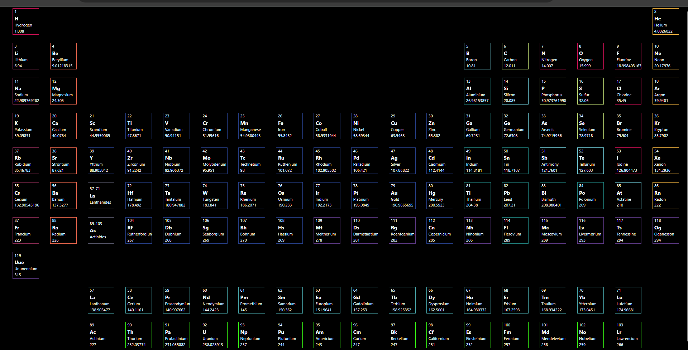
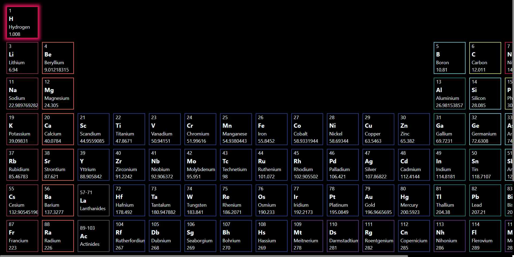
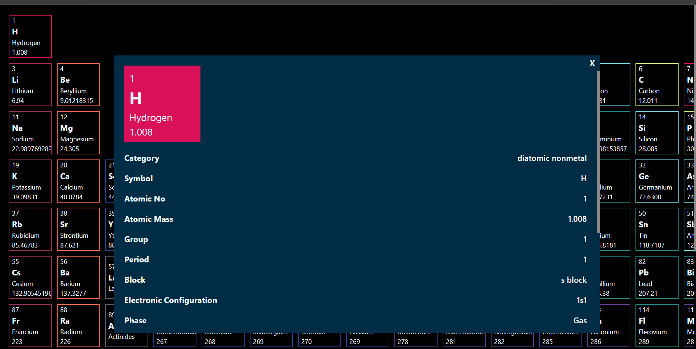
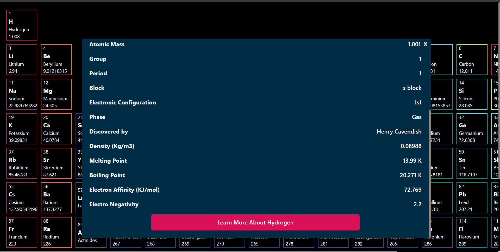

# Interactive Periodic Table

An interactive periodic table web application that allows users to explore information about elements dynamically. This project can be used for educational purposes or as a reference for chemistry-related applications.

## Features

- **Interactive UI**: Hover, click, and interact with elements to see more details.
- **Element Details**: Provides atomic information like symbol, atomic number, atomic weight, and more.

## Screenshots

### Over view of Periodic Table

### Hover effect

### On click modal

### Scrollable content


## Installation

To set up the project locally:

1. **Clone the repository**:
    ```bash
    git clone https://github.com/Jeevan-36/Interactive-Periodic-Table.git
    ```

2. **Navigate into the project directory**:
    ```bash
    cd Interactive-Periodic-Table
    ```

3. **Install dependencies** (if applicable, e.g., if you're using npm or another package manager):
    ```bash
    npm install
    ```

4. **Run the application**:
    ```bash
    npm start
    ```

## Usage

- **Hover**: Hover over an element make it to glow and helps to identify uniquely
- **Click**: Click on an element to see additional details like atomic mass, electron configuration, and other properties.


